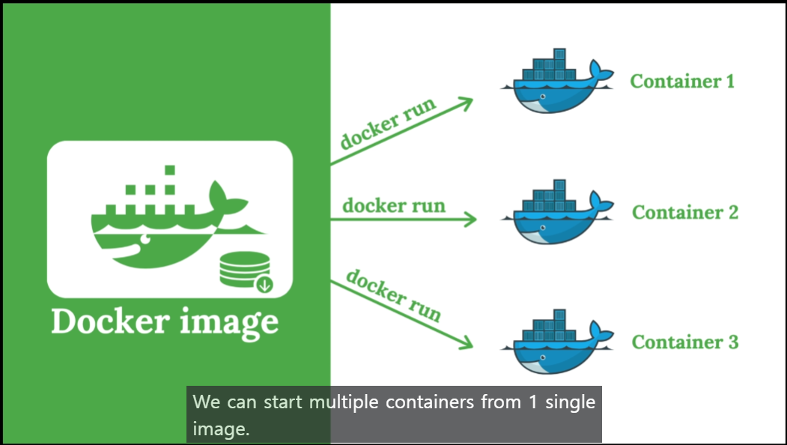

docker에 관한 정보와 사용법 정리

### Docker 란? 
Docker는 "컨테이너"라는 개념을 사용하는 오픈 소스 플랫폼. 컨테이너는 애플리케이션과 그것을 실행하는 데 필요한 모든 종속성(dependencies)을 하나의 패키지로 묶은 것. 이렇게 하면 개발자가 애플리케이션을 일관되게 실행할 수 있고, 환경에 관계없이 동일하게 작동함.

Docker의 주요 장점:

1. 환경 일관성: Docker를 사용하면, 개발자가 로컬에서 작업한 내용과 프로덕션 환경에서의 결과가 동일하게 나타남. 즉, '내 컴퓨터에서는 잘 작동하는데...'라는 문제를 해결할 수 있음.
2. 분리 및 격리: 각 컨테이너는 별도의 프로세스와 파일 시스템을 가지므로, 서로 다른 애플리케이션들 사이에 영향을 주거나 받지 않음.
3. 개발 및 배포 속도 향상: Docker 이미지를 빠르게 생성하고 배포할 수 있으며, 이를 통해 CI/CD(Continuous Integration and Continuous Delivery) 파이프라인을 쉽게 구축할 수 있음.
4. 확장성 및 이식성: Docker 컨테이너는 거의 모든 곳에서 실행될 수 있으므로 클라우드 환경으로 쉽게 마이그레이션하거나 서비스를 확장할 수 있음.
5. 버전 관리와 컴포넌트 재사용: Docker 이미지는 버전화 될 수 있고, 여러 프로젝트에 걸쳐 재사용될 수 있는 베이스 이미지(base image)를 만들어서 사용할 수 있음.
따라서 Docker는 개발부터 배치까지 전체 생명주기에 걸친 워크 플로우(workflow)를 단순화하여 일관된 환경 제공과 빠른 배치 등을 가능하게 함.

# Docker for windows

> Unix 기반이므로, MacOS에서는 설치와 관련해서는 코멘트 남길게 없습니다. 잘 설치해서 잘 실행시키면 됩니다.

도커 윈도우 버젼과 맥에서의 차이점(feat. 뤼튼, GPT 4.0)
Docker는 기본적으로 Linux 컨테이너를 실행하기 위한 플랫폼입니다. 그러나 Docker는 Windows와 macOS에서도 사용할 수 있도록 설계되었습니다. 이 때, 각 운영 체제에서 Docker를 실행하는 방식에는 차이가 있습니다.

1. Windows: Windows 10 Pro, Enterprise 또는 Education 버전에서 Docker Desktop을 직접 설치하고 사용할 수 있습니다. 이 경우 Hyper-V와 Containers라는 Windows의 기능을 활용하여 Linux 컨테이너를 실행합니다. 또한, 최신 버전의 Docker Desktop에서는 WSL 2(Windows Subsystem for Linux 2)를 활용하여 보다 향상된 성능과 호환성을 제공합니다. 그러나 Home 등의 다른 버전에서는 Hyper-V가 지원되지 않으므로, Docker Toolbox라는 별도의 도구를 사용해야 합니다. 이 경우 VirtualBox 위에 가상 머신을 생성하고 그 안에서 Docker를 실행합니다.
> 이 부분은 잘못됨. 설치 시 WSL2와 Hyper-V 중 어떤 것을 이용할지 선택하도록하며 WSL2 설치를 권장함.

WSL 2 선택했는데 버젼이 낮아서 업데이트 하라고하면서 다음 경로로 안내해줌.
https://learn.microsoft.com/ko-kr/windows/wsl/install-manual#step-4---download-the-linux-kernel-update-package

macOS: macOS에서 Docker Desktop은 xhyve라는 macOS용 경량 가상화 솔루션 위에 동작합니다. 따라서 실제로 컨테이너가 실행되기 위해서는 가상 머신이 필요하지만, 이 과정은 대부분 자동으로 처리되며 사용자 입장에서 거의 체감하지 못할 정도입니다.
참고로, Windows와 macOS 모두 파일 시스템 공유나 네트워크 포워딩 등 추가적인 기능을 제공하여 개발자가 로컬 환경과 컨테이너 사이에 원활하게 작업할 수 있게 지원합니다.

결론적으로 중요한 차이점은 운영 체제별로 내부적으로 가상화 방식과 통합 방식에 약간씩 차이가 있다는 점입니다만, 대부분의 일반적인 용도로 Docker를 사용하는 경우에는 크게 문제될 것 없습니다.

# Docker로 DB schema 그리기

## Docker 사용법

- Pull an image from the Docker

<code> docker pull `<image>:<tag>` </code>

- Start a container

    docker run  
    --name<container_name>      
    -e<environment_variable>    
    -d  
    `<image>:<tag>`

- Image and Container
Container는 Image로 부터 파생된 instance로 하나의 Image로부터 여러개가 생성될 수 있다.

- Run command in container

    docker exec -it  
    <container_name_or_id>  
    `<command>` [args]

- View container logs
  
    docker logs
    <container_name_or_id>

Docker 명령어와, SQL query를 통해 조작할 수 있다.

좀 더 쉽게 접근하는 방법으로 Table Plus를 설치해서 이용

### Docker에서 shell 의 개념

Docker에서 "shell"이란 운영 체제의 명령 줄 인터페이스를 말합니다. 쉘은 사용자와 운영 체제 사이의 인터페이스 역할을 하며, 사용자가 입력한 명령을 해석하고 실행합니다.

Docker 컨테이너는 일반적으로 Linux 또는 Unix 계열의 운영 체제를 기반으로 하므로, 대부분의 Docker 컨테이너에는 bash, sh 등의 쉘이 포함되어 있습니다. 이런 쉘을 통해 Docker 컨테이너 내부에 접근하고 다양한 명령을 실행할 수 있습니다.

예를 들어, docker exec -it [컨테이너 이름] /bin/bash라는 명령은 특정 Docker 컨테이너 내부에서 bash 쉘을 실행하는 것입니다. 이렇게 하면 해당 컨테이너 내부에서 직접 명령을 입력하고 결과를 확인할 수 있습니다.

결국 Docker에서 shell은 컨테이너 안의 환경과 상호작용하는데 필요한 도구라고 볼 수 있습니다.

= 컨테이너에 여러 명령어를 입력할 터미널을 여는 것
